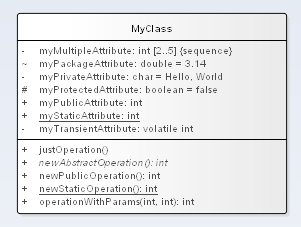

# Диаграмма классов

## Класс

### Описание класса

* Название, классов согласно **CamelCase**
* Абстрактный класс отображается *курсивом* названия класса
* **Cardinality** обозначается в правом верхнем углу

### Атрибуты класса

Детальное описание атрибута:

1. Область видимости (Public/Protected/Private/Package)
1. Наименование атрибута в формате **camelCase**
1. Транзиентность (*volatile*)
1. Тип данных (необязательно)
1. **Multilicity** и её атрибуты: *Sequence*, *Ordered*, *Bag*
1. Значение по умолчанию

Статичные атрибуты отмечаются _нижним подчеркиванием_

### Методы класса

Детальное описание метода:

1. Область видимости (Public/Protected/Private/Package)
1. Наименование метода в формате **camelCase**
1. Типы параметров через запятую(если есть)
1. Типы результата (необязательно)

* Статичные методы отмечаются _нижним подчеркиванием_
* Абстрактные методы омечаются *курсивом*

## Ассоциация и её полюса

