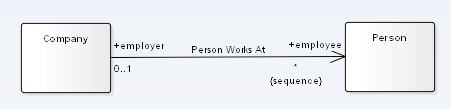
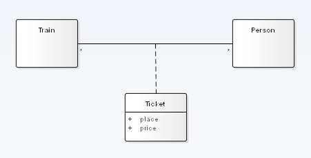

# Диаграмма классов

## Класс

### Описание класса

* Название, классов согласно **CamelCase**
* Абстрактный класс отображается *курсивом* названия класса
* Количество элементов (**Cardinality**) обозначается в правом верхнем углу

### Атрибуты класса

Детальное описание атрибута:

1. Область видимости (Public/Protected/Private/Package)
1. Наименование атрибута в формате **camelCase**
1. Транзиентность (*volatile*)
1. Тип данных (необязательно)
1. Кратность (**Multiplicity**)  и её атрибуты: *Sequence*, *Ordered*, *Bag*
1. Значение по умолчанию

Статичные атрибуты отмечаются _нижним подчеркиванием_

**Важно!**

Не следует явно указывать идентификаторы в классе

### Методы класса

Детальное описание метода:

1. Область видимости (Public/Protected/Private/Package)
1. Наименование метода в формате **camelCase**
1. Типы параметров через запятую(если есть)
1. Типы результата (необязательно)

* Статичные методы отмечаются _нижним подчеркиванием_
* Абстрактные методы омечаются *курсивом*

## Ассоциация и её полюса

Атрибуты ассоциации:
* Наименование (отражает значение ассоциации)
* Направленность (Одностороняя / Отсутствует)

Атрибуты полюса:
* Наименование Полюса (атрибут)
* Направленность (Одностороняя / Отсутствует)
* Кратность (**Multiplicity**) и её атрибуты: *Sequence*, *Ordered*, *Bag*
* Квалификатор

### Квалификация ассоциаций

Для связей типа *Один-ко-Многим* и *Многие-ко-Многим* возможно указать атрибут, 
по которому можно отличать отдельный объект из множества снижая тем самым 
кратность до 1.

### Атрибуты кратности

По умолчанию множество неупорядоченное и без дубликатов

* *Ordered* - упорядоченное множество без дубликатов
* *Sequence* - упорядоченное множество допускающее дубликаты
* *Bag* - неупорядоченное множество допускающее дубликаты

### Класс ассоциации

Необходимость в *классе ассоциации* возникают в том случае, когда наличие самой 
связи недостаточно для отражения предметной области и требуется задавать 
дополнительные атрибуты. Но нужно помнить что выделение ассоциацию в класс 
принципиально отличается от *класса асссоциации*. Класс ассоциации может иметь 
другие ассоциации, методы и вести себя почти как обычный класс и обладает
уникальностью.

В данном случае выделение ассоциации в отдельный класс имеет смысл, если
ассоциация начинает вести себя как самостоятельная сущность в процессе. Это 
может происходить со временем когда возрастает сложность бизнес-логики объекта, 
или бизнес-логика класса ассоциации выходит за рамки простой ассоциации.

### N-арные ассоциации (N-ary associations)

Поскольку ассоциация между двумя классами - это по сути кортеж, то экстраполируя,
можно предположить что ассоциация может быть не только между двумя, но и тремя и
так далее ассоциациями. 

### Типы ассоциаций

* Простая
* Наследование: Генерализация, Специализация
* Реализация (интерфейса)
* Зависимость
* Использование

